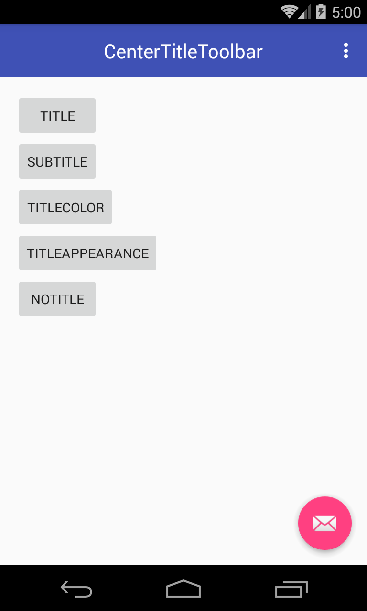
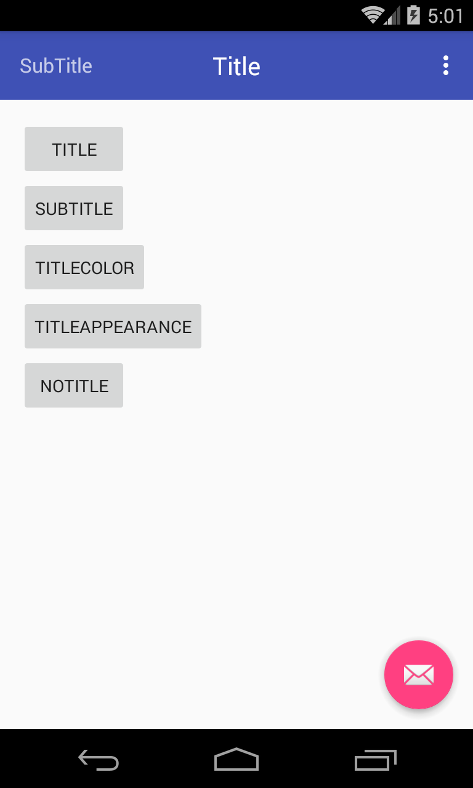
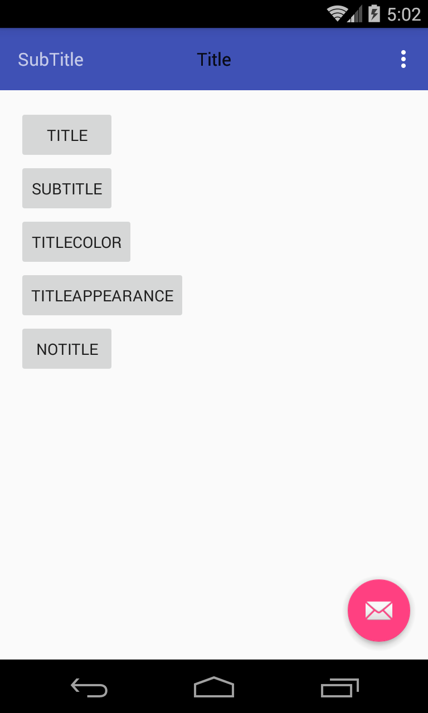

# CenterTitleToolbar
标题居中的Toolbar

Toolbar本身的title不可以居中，但很多时候UI都要求标题居中。CenterTitleToolbar支持设置title的color，textAppearance

  
  

## 用法
CenterTitleToolbar直接继承自Toolbar，所以跟Toolbar的用法完全一样
```
<com.benio.toolbar.CenterTitleToolbar
    android:id="@+id/toolbar"
    android:layout_width="match_parent"
    android:layout_height="?attr/actionBarSize"
    android:background="?attr/colorPrimary"
    app:title="Title"
    app:titleTextColor="#24ea56"
    app:titleTextAppearance="@android:style/TextAppearance.Small"
    app:popupTheme="@style/AppTheme.PopupOverlay"/>
```

由于重写了Toolbar的方法，以下Toolbar的`titleMarginXx`属性会失效
* titleMargins
* titleMarginEnd
* titleMarginTop
* titleMarginStart
* titleMarginBottom
